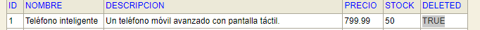
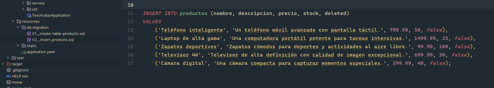
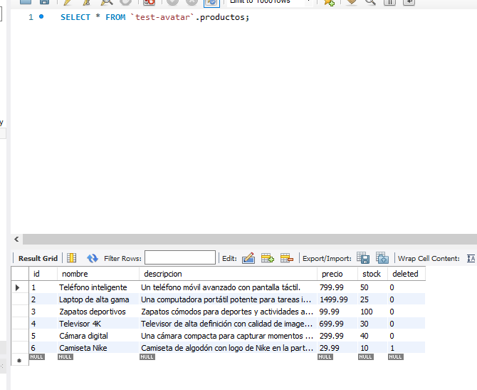
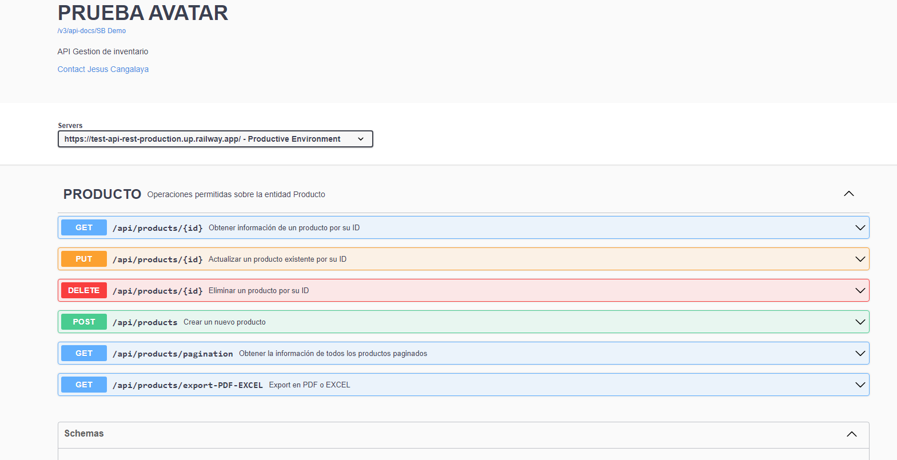

# Despliegue en Railway 🚂
 Este proyecto está desplegado utilizando [Railway](https://railway.app/), una plataforma de desarrollo y alojamiento en la nube. Railway simplifica el proceso de implementación, permitiéndote centrarte en la creación de tu aplicación sin preocuparte por la infraestructura subyacente.

## Características del Despliegue
- **Base de Datos MySQL:** La base de datos está desplegada y funcionando gracias a Railway, lo que garantiza un almacenamiento eficiente y seguro de los datos.
- **Spring Boot**

# Sistema para administrar productos en el inventario (PRODUCCIÓN).

"CRUD documentado en Swagger, con validaciones,
excepciones, exportación a PDF y Excel, y gestión
de inventario."

## Tecnologias

- **Java Development Kit (JDK) 17:** Asegúrese de tener instalado JDK 17 en su sistema. Puede descargarlo desde [Oracle](https://www.oracle.com/java/technologies/javase-downloads.html) o [OpenJDK](https://adoptopenjdk.net/).

- **Spring Boot: 2.7.15**.

- **Base de datos MySQL (PRODUCCION)**.

- **Swagger: https://test-avatar-api.up.railway.app/swagger-ui/index.html**

## Funciones

- CRUD de Producto.
- Validaciones básicas.
- Documentación con Swagger.
- Base de Datos MySql.
- Reportes a PDF y EXCEL con PAGINACIÓN.
- Eliminación lógica.
  
- Uso de DTO para tranferencia de datos.
- MapStruct para simplificar mapeo de objetos Java y obtener un mejor performance a diferencia a otras librerias.
- @RestControllerAdvice para manejar excepciones globales en mi proyecto.
- Paginación eficiente para no sobrecargar con mucha data.
- Uso de Constantes para Mejor Legibilidad.
- Utilización de Genéricos para Flexibilidad.
- Campos validados:
  

## Screenshots

En la imagen de arriba,se ejecutara la aplicación y se insertarán automáticamente 5 productos por defecto.

En la imagen de arriba, se muestra la interfaz de Workbench de la base de datos MySQL con los 5 datos.

La imagen anterior muestra la documentación de todos los endpoints de la API, que se encuentra en `https://test-avatar-api.up.railway.app/swagger-ui/index.html`.

